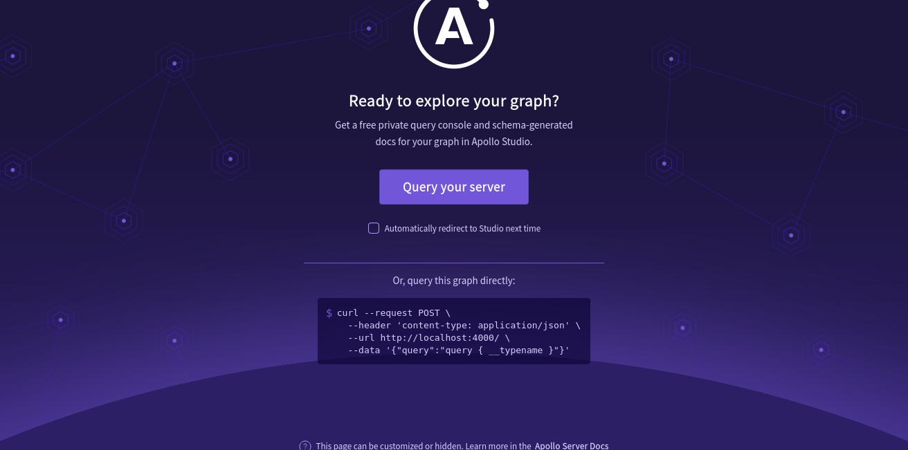

# Capstone Project For AI-enhanced Web3 Frontend Development Course

Welcome to the Capstone Project for the AI-Enhanced Web3 Frontend Development Course at dProgramming University.
This project was completed and submitted for approval by:
Abdulsalam Abdulkareem

MY EXPERIENCE AND CHALLENGES FACED:

SECTION 1: HTML
-In this section i learnt about the basic syntax of html and was able to build the HTML structure of the Token Minter dApp. It was an exciting experience as delivering the project was easy due to the simplicity and detailed explanation from the course lessons. I faced no major challenges completing this section.

SECTION 2: CSS
-In this section i learnt about CSS, its syntax as well as importance for styling web pages. I learnt about CSS3 and how it has introduced essential features for styling modern web applications. I was able to complete the styling of the dAPP with AI assistance as well as overriding some of the default values from the bootstrap Framework I was also able to customize the dApp to my taste by overriding some of the bootstrap CSS in my custom.css stylesheet.

- I faced only one challenge. I was trying to customize a hover effect for the links on the navigation bar by overriding the bootstrap css. My changes were not being effected on the webpage. However i realized that it was a problem of specificity of the styling as bootstrap style was taking higher preference. i solved this by using the !important keyword in the selector.

SECTION 3 & 4 JAVASCRIPT API AND GRAPHQL
-In this sections i learnt how to use javascript. I learnt its syntax, operations, functions and how to handle javascript events. I also leant how to work with API's with an example of implenting the coingecko api in my dApp which i followed along in the lesson and also implemented in my project. I learnt how to use Graphql apollo server to wrap my REST api.

- The challenges in this section were few, it was mainly learning how to use graphql instead of conventional REST api. But i was able to overcome this with the lessons as well as asking AI for more explanations on the concept.

SCREENSHOTS OF SERVER, FRONTEND ANND WORKPLACE

.png)

SECTION 5 TYPESCRIPT
-In this sections i learnt how to use typescript. I learnt its syntax, operations, functions classes and constructors. I also leant how to convert javascript into typescript in my dApp which i followed along in the lesson and also implemented in my project. 

- The challenges in this section were few, it was mainly learning how to follow the steps needed to implement typescript in my project using the terminal commands and editing the package.json and tsconfig.json. But i was able to overcome this by following along with the lessons as well as asking AI for more explanations on the concept as well as assistance in converting my javascript to typescript.

SCREENSHOTS OF TYPESCRIPT WATCH/COMPILE TERMINAL, SERVER, FRONTEND ANND WORKPLACE

.png)

.png)

.png)